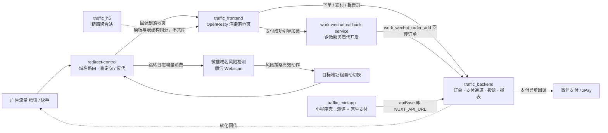
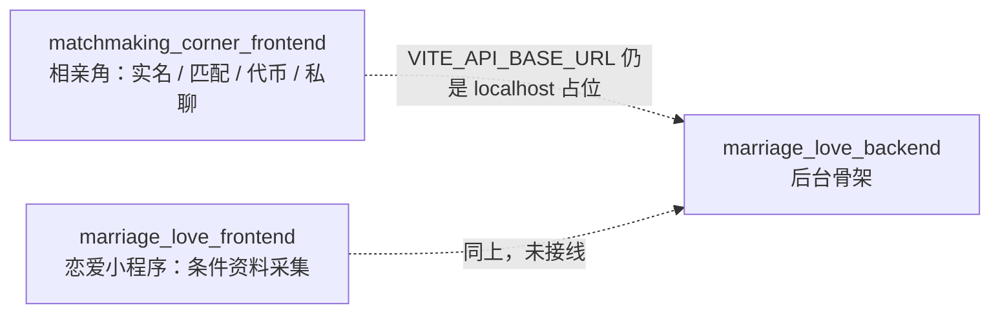

# traffic-placement · 投放与婚恋两条产品线

组织里 10 个仓库在做的是同一件事的不同侧面：**把买来的流量接进一个能出结果、能收款、能沉淀到私域的页面**。区别只在承接端与规模。

| 业务线 | 标识 | 仓库数 | 现状 |
| --- | --- | --- | --- |
| 投放线 | 标签 `line:traffic` / team `traffic` | 7 | 生产在跑：域名路由 → 落地页 → 订单支付 → 企微承接 → 域名风控自动换域，闭环完整 |
| 婚恋线 | 标签 `line:marriage-love` / team `marriage-love` | 3（不含 `.github`） | 起步阶段：两个小程序前端沿用同一套 uni-app 模板，后台只有骨架，接口尚未接通 |

## 仓库总览

| 仓库 | 线 | 角色 | 技术栈 |
| --- | --- | --- | --- |
| `redirect-control` | 投放 | 最外层域名路由与反代、微信域名风险检测、目标地址组自动换域 | Go 1.25 / Gin / GORM / MySQL 8.x ＋ React 19 / Vite / Tailwind 4 / shadcn/ui（`go:embed` 打进单文件） |
| `traffic_frontend` | 投放 | 前台入口：31 套落地页模板渲染、Lua 产品路由、共享资源注入、支付站页面 | OpenResty / Lua / Nginx |
| `traffic_backend` | 投放 | 中枢后端与管理后台：订单、支付通道、投诉退款、流量链接、模板、报表、广告回传、落地页巡检、RBAC | Nuxt 4 / Nitro / TypeScript / Drizzle ORM / MySQL |
| `work-wechat-callback-service` | 投放 | 企业微信服务商代开发：回调验签解密、授权换码、外部联系人与订单联动、授权管理面板 | Nuxt 4 / Nitro / Ant Design Vue / Drizzle ORM / MySQL / Pino |
| `traffic_miniapp` | 投放 | 微信内承接壳：两套独立小程序工程，题库测评 ＋ WebView 承载 H5 ＋ 原生支付 | 微信小程序原生 / JavaScript |
| `traffic_h5` | 投放 | 精简并行的 H5 聚合支付站：门户 ＋ 模板 ＋ zpay ＋ 报告页 ＋ 6 模块后台，独立库独立部署 | Nuxt 4 / @nuxt/ui / Drizzle ORM / MySQL / zpay |
| `matchmaking_corner_frontend` | 婚恋 | 相亲角小程序前端：实名认证、条件匹配、会员与代币、私聊、活动、举报、运营弹窗位 | uni-app / Vue 3 / Vite / UnoCSS / Pinia |
| `marriage_love_frontend` | 婚恋 | 恋爱小程序前端：登录与主题、相亲条件资料采集、Webview 承接测算页 | uni-app / Vue 3 / Vite / UnoCSS / Pinia |
| `marriage_love_backend` | 婚恋 | 婚恋线管理后台：账号 / 角色 / 权限 / 代币账户 / 会话 / 营收 | Nuxt 4 / @nuxt/ui / Drizzle ORM / MySQL |
| `.github` | 组织 | 组织 profile、两条线的 issue 表单、派活规范 | GitHub 配置仓库 |

---

## 一、投放线：五个环节咬成一条链路

### 咬合关系（每条都能回仓库核）

1. **`redirect-control` 在最外层，只管"这个域名现在该往哪送"。** 规则 `action` 必须显式为 `redirect` 或 `proxy`，反代沿用 `{host}` / `{path}` / `{query}` 占位组址并加 `Via: 1.1 redirect-control` 防回源循环。它只认 MySQL 8.x（启动时 `SELECT VERSION()` 拒绝 5.7 与 MariaDB）。
2. **`traffic_frontend` 仓库里只有前台资产。** `landing_templates/**`、`shared_assets/**`、`lua/**`、`conf/**` 四块，订单、支付、投诉、报表、后台一律在 `traffic_backend`；`lua/product_router.lua` 选品路由、`lua/product_template_render.lua` 渲染注入、`lua/payment_site_config.lua` 与 `payment_checkout_guard.lua` 撑支付站。部署放行的硬要求：`/api/**`、`/report/**`、`/reports/**`、`/r/**` 必须透传后端，不能被静态化拦掉。
3. **`traffic_backend` 是数据与流程的唯一中枢。** 落地页模板由后台 `landing_templates` 模块维护、供 `traffic_frontend` 渲染；报表用 handlebars ＋ `report_shell` 静态壳生成并按 shareKey 公开。腾讯/快手转化回传、地区价格与地区转化回传、公众号 openid 导出都汇在这一层。
4. **私域闭环收在一个回调接口上。** `work-wechat-callback-service` 收到 `add_external_contact` 时按 `state`（`tenant:<租户ID>`）查订单详情、把 `user_info` 映射成中文客户备注，再把订单号、添加员工与累计数 POST 到 `traffic_backend` 的 `POST /api/frontend/callback/work_wechat_order_add`。只有单套服务商应用、固定回调地址，不支持多主体。
5. **`traffic_miniapp` 是微信内的承接端，不是独立业务。** 同仓两套各自可导入开发者工具的工程：`relationship-journal`（关系状态测试，15 题 4 维度）与 `relationship-compass`（恋爱默契情境测试，12 题 4 维度），appId 各自独立。`config.js` 的 `apiBase` 指向 `origin-api.tianjinhuanghuacai.cn`，与 `traffic_backend` 测试部署 workflow 的 `NUXT_API_URL` 同一个地址；H5 地址由页面参数传入，服务端用 `NUXT_MINI_H5_BASE_URL` / `NUXT_MINI_H5_ALLOWED_HOSTS` 限定壳内 WebView 能加载的域。测评在本地算、结果不上传。
6. **微信域名风控有两个互不相同的检测点，别混。** `redirect-control` 消费自己持久化的 `redirect_logs`（游标增量、检测资格层过滤静态资源与未引用地址）驱动地址组故障切换：默认前 4 次在同一成员生成新实例，第 5 次置 `blocked` 换候选，无候选则组 `exhausted`；恢复探测连续两次供应商 200 才放回。`traffic_backend` 的落地页巡检是任务式的 playwright ＋ 鼎信 Webscan 逐级跟踪，管的是"这个页面现在还打不打得开"。同一个供应商、两种职责。
7. **`traffic_h5` 属于投放线，但不在生产链路上。** 它是同一业务模式的轻量平行形态：只保留 zpay（易支付协议），砍掉腾讯/快手回传、进量链接体系、落地页巡检、企微承接与微信支付；支付成功后直接进报告页。模板从 `traffic_frontend` 合并 25 套、自有 11 套，现共 36 套；独立仓库、独立数据库、独立部署，与生产系统不共库。当前 `server/api/admin` 下 auth / 角色 / 用户 / 投诉 / 配置 / 概览已在写，README 里"P0 待开始"的状态表已滞后于代码。

### 三条容易踩的边界

- 域名被封的自动换域只由 `redirect-control` 执行；`traffic_backend` 与 `work-wechat-callback-service` 都不改域名，只被域名影响。
- 落地页模板同时存在于 `traffic_frontend`（线上运行）与 `traffic_h5`（精简站），改模板要先确认改的是哪一侧，两边不会自动同步。
- 企微回调服务不改订单金额与支付状态：它按 `state` 只读查订单，加微结果经 `traffic_backend` 的回调接口写进订单的企微字段。

---

## 二、婚恋线：两个前端一套后台，接口还没接上

| 仓库 | 已成型 | 缺口 |
| --- | --- | --- |
| `matchmaking_corner_frontend` | `src/api` 下已铺 16 个模块目录：`real-name`、`match`、`member`、`coin`、`chat`、`activity`、`news`、`group`、`report`、`popup`、`channel`、`action`、`app`、`user-info` 等 | `env/.env.production` 的接口地址还是模板占位 `http://localhost:8080/prod`，未指向任何真实后端 |
| `marriage_love_frontend` | 资料采集页系已铺齐：出生年月、学历、收入、身高、户籍、婚史等条件项 ＋ 登录、主题、`common/webview` 承接测算页 | 同上；与 `matchmaking_corner_frontend` 共用同一套 uni-app 模板（两者 `package.json` 的 `name` 都是 `uniapp-vue3-project`），公共改动需要双向同步 |
| `marriage_love_backend` | `xcyml` 分支已有 Nuxt UI Dashboard 骨架：`admin/[entity]` 通用 CRUD、`users`、`roles`、`permissions`、`coin-accounts`、`im/conversations`、`finance/revenue`，带 CI workflow | **默认分支 `main` 只有一个空初始化提交**；C 端接口、鉴权与业务表均未落地 |

后台骨架里已经出现 `coin-accounts` 与 `im/conversations`，方向上更贴近相亲角的代币与私聊需求（这是从页面清单看到的倾向，不代表已定方案）。

### 与投放线的关系

- **共用的是模式，不是服务。** 婚恋线沿用投放线跑通的"资料/测评采集 → 结果页 → 支付 → 私域承接"打法，但没有引用投放线任何仓库的代码、库表或接口。
- **婚恋线暂时不接投放线的域名风控。** 域名封禁与换域能力目前只在 `redirect-control` 内，婚恋产品上线放量前需要单独决定复用方式。
- **两条线共用组织级约定**：issue 表单、`line:*` 标签、`docs/**` 归档规则与密钥不进仓库的要求，见 `docs/task-assignment-policy.md`。

---

## 三、跨仓库约定

- **默认分支不一致**：`traffic_frontend` 是 `master`，其余仓库是 `main`。PR 只有合进各自默认分支才会 `Closes` 掉 issue。
- **派活入口**：各仓库 New issue → 选「任务（traffic 线）」或「任务（marriage-love 线）」表单，验收标准必填；线的归属看 `line:*` 标签，人的归属看 Assignee，禁止用 `@team` 派活。规范见 [`../docs/task-assignment-policy.md`](../docs/task-assignment-policy.md)。
- **文档归档**：根目录只留入口型文档，业务文档进 `docs/**` 分类（`api/`、`architecture/`、`business/`、`database/`、`deployment/`、`operations/`、`audits/`、`ai-work/`、`reports/`）。
- **AI 协作规范**：各仓库根目录 `AGENTS.md`；改动前先读它和 `docs/README.md`，不要依赖历史记忆。
- **敏感配置**：支付密钥、企微 `suite_id` 与 permanent_code、鼎信 Webscan API Key、广告 token 一律不进仓库，只放部署机器环境变量。
