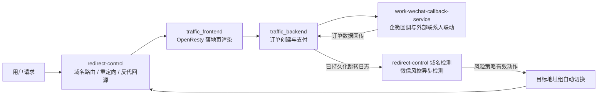

# traffic-placement · 流量投放

流量落地页投放系统：从域名路由、落地页渲染、订单支付，到企业微信承接转化，并以微信域名风险检测与自动换域贯穿全程。各环节拆分为独立可部署的子系统，统一在本组织下维护。

## 系统组成

| 仓库 | 定位 | 技术栈 |
| --- | --- | --- |
| `traffic_frontend` | 前台入口：OpenResty Lua 路由、落地页模板渲染与共享资源注入 | OpenResty / Lua / Nginx |
| `traffic_backend` | 业务后端：落地页订单、支付通道、投诉处理、报表与后台管理 | Nuxt 4 / TypeScript / Drizzle ORM |
| `work-wechat-callback-service` | 企业微信服务商代开发：回调验签解密、授权换码、外部联系人与订单联动 | Nuxt 4 / Nitro / MySQL / Drizzle ORM |
| `redirect-control` | 重定向与反向代理管理服务：域名路由规则引擎、微信域名风险检测、风险策略与目标地址组自动切换 | Go / Gin / GORM / SQLite + React / shadcn/ui |

## 核心能力

- **域名路由与反代**：规则引擎支持重定向与反向代理回源两种动作，域名、路径前缀、通配、正则、全局与兜底匹配，管理后台可视化配置。
- **落地页投放**：OpenResty 承载多套落地页模板，统一注入共享资源、本地化依赖与法务协议。
- **订单与支付**：落地页创建订单、拉起支付、支付轮询，配套投诉处理与报表生成。
- **企微承接**：支付成功引导添加企业微信；回调服务识别外部联系人、关联订单并回传后台，完成流量到私域的闭环。
- **域名风险检测**：增量消费已持久化的跳转日志，异步检测来源/目标 URL 的微信风控状态，识别停止访问、蓝标提示、长按复制拦截等风险；按可配置风险策略（自动切换 / 仅告警 / 忽略）产生有效动作，目标地址组据此自动故障切换。

## 请求与风控链路

典型业务流程：用户经域名路由进入落地页 → 浏览后创建订单并支付 → 支付成功引导添加企业微信 → 企微回调服务识别外部联系人、关联订单并回传后台。与此同时，跳转日志被异步消费做微信域名风控检测，一旦域名被拦截，按策略告警并自动切换到健康域名，保障投放链路持续可用。

## 仓库约定

- 所有仓库默认私有，支付密钥、回调密钥等敏感配置一律不进仓库，走环境变量。
- 各仓库根目录的 `AGENTS.md` 为 AI 协作规范；业务文档统一放 `docs/**` 并按类型归档。
- 检测事实与业务处置分离：供应商原始风险码不可变，有效动作由策略计算；检测服务只负责发现与告警，地址组切换由独立的故障切换服务完成。
- 部署放行要求（traffic_frontend）：`/api/**`、`/report/**`、`/reports/**`、`/r/**` 必须透传至后端，不可被静态化拦截。
